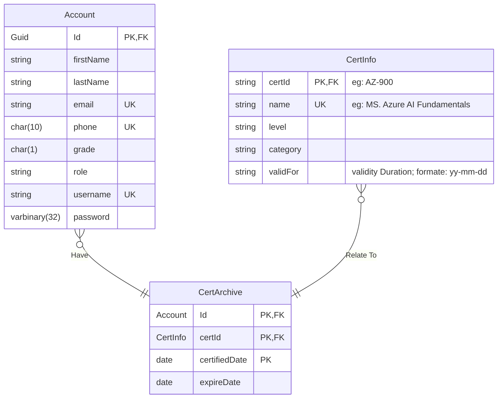

# Introduction 
CSCE 590 Final Project - Spring 2024

In partnership with professors @ Capgemini, we built a Programming Certificate organizer.

Our project allows users to upload their certificates, track their status, and keep an eye on soon-to-expire certs.
It also allows system administrators to view all co-worker certificates, and confirm that their professionals are up to date.

# Team Members
- Ali Firooz
- Burt Sumner
- David Eta
- Nishwa Tuniki
- Patrick Burroughs
- Supriya Nayanala

# Getting Started
To get started:
- 1 Terminal:
 - cd into the frontend api folder: "consceafrontend"
 - `npm install`

# Build and Test
To Build the Project:

- 2 terminals
 - Terminal 1:
 - cd into the backend api folder: "Conscea-Api"
 - `dotnet run`

 - Terminal 2:
 - cd into the frontend api folder: "consceafrontend"
`npm start`

TODO: Describe how to run the tests. 

# DB Design

**Notes:**
- For the sake of simplicity, all `string` types translate to `VARCHAR(100)` in SQL.

- Using the `Account` name instead of `User`, to keep further changes in the backend to a minimum.

- All attributes with no examples, have the same name in the excel files and thus will take the same values.
 
- If attribute `CertInfo.validFor` was defined, it overrides the user-defined attribute `CertArchive.expireDate` and sets it to `CertArchive.certifiedDate + CertInfo.validFor`. Otherwise, the user has the option to set their own `CertArchive.expireDate` or not. 

> TODO: should we keep `CertInfo.validFor`? or is it not worth the hassle?

> TODO: can we use generated GUIDs instead of the `Account.Id` given in excel files?

